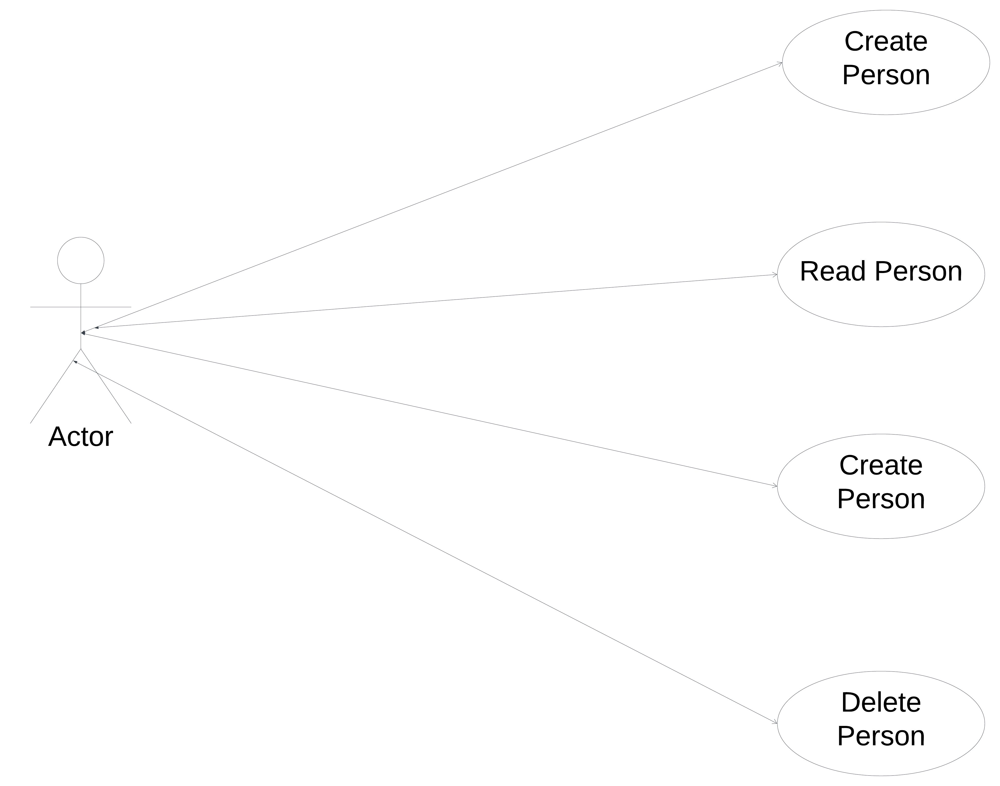
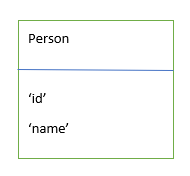

# Django CRUD API for 'Person Management'
This is a simple Django project that demonstrates CRUD (Create, Read, Update, Delete) operations through a RESTful API. It manages 'Person' objects that have a 'name' attribute.
## Table of Contents

* Installation
    * Prerequisites
* Usage
    * API Endpoints
* Testing
* UML and ER Diagrams

## Installation
First, clone the github repository to your local machine:
https://github.com/ClintonNwokocha/hng_backend_project2.git

### Prerequisites
* Python 3.x
* Django
* Virtualenv (recommended)

### API Endpoints
- **Create /api/: Creates a new person. **e.g**: 'https://hngproject2.onrender.com/api/?name=Clinton%20Nwokocha'
- **Read /api/<int:user_id>/: Retrieves the person with the given ID. **e.g**:
  "https://hngproject2.onrender.com/api/1/"
- **Update /api/<int:user_id>/update/: Updates the person with the given ID. **e.g**: "https://hngproject2.onrender.com/api/1/update/?name=Princess%20Nwokocha"
- **DELETE /api/<int:user_id>/delete/: Deletes the person with the given ID. **eg**: https://hngproject2.onrender.com/api/1/delete/"

### API Endpoints
#### Create a New Person
- Endpoint: /api/
- Method: POST
- Body Parameters: {"name": "John Doe"}
- Example: 'curl -X POST -H "Content-Type: application/json" -d '{"name": "John Doe"}' https://hngproject2.onrender.com/api/'
#### Read a Person
- Endpoint: /api/<user_id>/
- Method: GET
- Example: 'curl https://hngproject2.onrender.com/api/1/'
#### Update a Person
- Endpoint: /api/<user_id>/update/
- Method: PUT
- Body Parameters: {"name": "Jane Doe"}
- Example: 'curl -X PUT -H "Content-Type: application/json" -d '{"name": "Jane Doe"}' https://hngproject2.onrender.com/api/1/update/'
#### Delete a Person
- Endpoint: /api/<user_id>/delete/
- Method: DELETE
-Example: 'curl -X DELETE https://hngproject2.onrender.com/api/1/delete/'

## Testing
To run the API tests, execute the following command;
python test_api.py

## UML and ER Diagrams
see  and 

  
